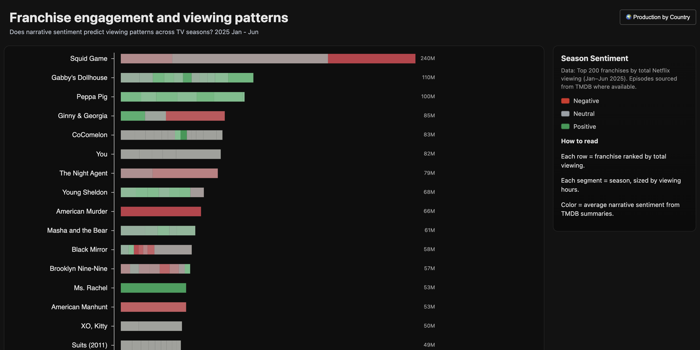

# Franchise engagement and viewing patterns

An interactive visualization exploring Netflix franchise viewing patterns and narrative sentiment across seasons. **Toggle between franchise-level and production-country-level views** to reveal how emotional tone and engagement vary by content origin.

## 🔗 Live Demo

- https://hoonkim0123.github.io/Data-Visualization-Information-Aesthetics/

## 📖 About

This project analyzes Netflix's Top 200 TV franchises to reveal how audiences engage with long-running series — and how emotional tone (derived from TMDB episode summaries) shifts across seasons.

### Main Visualization: Franchise Spine
- Each row represents a franchise ranked by total viewing
- Each segment represents a season, sized by viewing hours
- Color shows average narrative sentiment (negative → neutral → positive)
- Click a season to explore episode-level details

### Secondary View: Production by Country
- Toggle via the **"🌍 Production by Country"** button in the header
- Shows top 10 production countries aggregated from all Netflix content
- Each country bar represents total viewing hours of its produced content
- Color indicates weighted average sentiment of productions from that country
- Hover to see the top franchise from each country
- **Note:** Shows where content is *produced*, not where it's consumed

## 📊 Data

**Netflix – What We Watched (2025 Jan–Jun)**
- Viewing hours for the top franchises

**TMDB Episode Overviews**
- Episode summaries and metadata

**Custom Sentiment Lexicon (lex_custom.csv)**
- Used to score narrative tone at the episode level

## 📝 Author

**Saehun Kim** (he/him)  
MS Data Visualization '25  
Parsons School of Design
